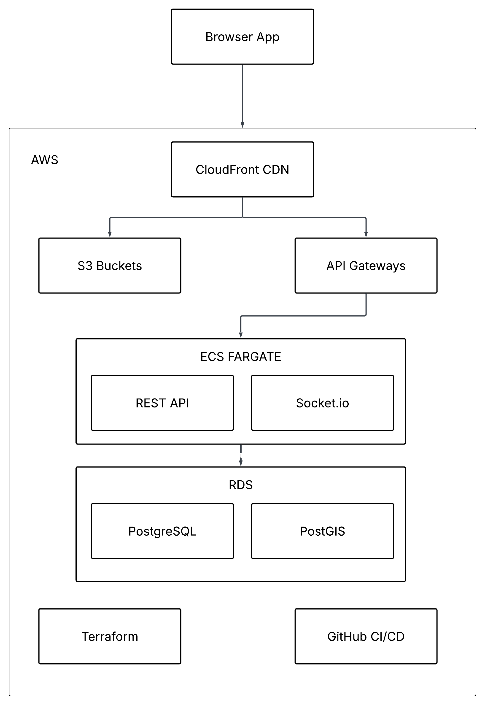

# RouteExplorer

A Web App for motorcycle riders to track their routes in real time via GPS and visualize all past rides on a map

## Architecture

1) The browser visits the URL and CloudFront delivers the React app's static files 
   (HTML, JS, CSS) from S3 to the browser — this is a one-time load

2) All subsequent API calls and WebSocket connections go from the browser through 
   CloudFront to API Gateway, which forwards them to ECS

3) ECS Fargate runs a Docker container with two things inside: Node/Express handling 
   all REST API endpoints, and Socket.io running the WebSocket server that listens 
   for live GPS points streaming in from the phone during a ride

4) RDS manages the database — PostgreSQL stores users, rides, and route points, 
   with the PostGIS extension enabling geographic data types and spatial queries

5) Terraform defines all the AWS infrastructure above as code
